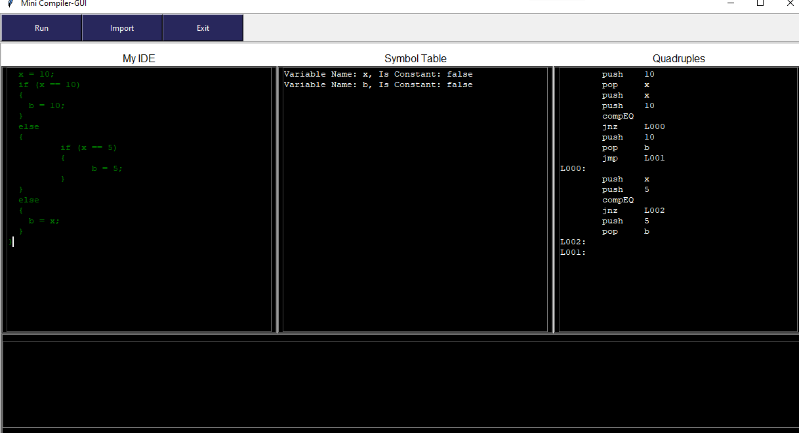

# Mini-compiler

### Project Intro

*The main output of this project is designing a simple programming language and implementing its compiler, to achieve this goal the following points were to be done:*

- Designing and implementing the language and its rules
  - Designing the lexical analyzer
  - Designing the parser rules
- Designing a symbol table
- Implementing actions to execute upon successful reduction of parser rules
- Detecting syntax and sematic errors
- Translating input written in our language to assembly-like quadruples

*The used tools and technologies for this purpose were*

- Yacc(Bison) and Flex for the lexical analyzer and the parser rules

  

  

  

- C language for designing the actions executed upon parser rules reduction

  

- Python for the GUI

  

  

*So please make sure you have all these dependencies installed on your machine to be able to run our code*

*Then to run our code, execute the following command from your terminal*

```powershell
python .\compiler_gui.py
```

***

### Language Design

*In this phase we designed a simple language and implemented its lexical analyzer and parser rules*

##### The Language

- Declaring and initializing a variable

  - Notes:

    - A variable name should start with a  letter, then it can include other alphanumeric characters but not special characters
    - The variable datatype is determined according to the first value assigned to it
    - Datatypes can be either integer, float, string or boolean. This datatype cannot be changed for the variable after declaration
    - Variables can be declared as constant or normal variables

  - Example:

    ```python
    w = 10;
    x = 1.5;
    y = "test";
    z = true;
    ```

- Declaring and calling methods

  - Notes:

    - Defining a method is done by preceding the method name by the word `def`
    - Method names start with a 'dollar sign' `$`, then a letter, then it can include other alphanumeric characters but not special characters
    - Method arguments are named exactly like variables but with an 'at sign' `@` at the beginning
    - If more than one method is to be declared in the same program, the arguments of each method should have unique names. No two methods are allowed to have the same argument names. This is our design to the language
    - To pass a value calculated inside a method, this is done by passing a variable to the function call and this variable will be treated as a variable that is passed by reference

  - Example:

    ```python
    def $sum(@x, @y, @z)
    {
      @z = @x + @y;
    }
    
    a = 1;
    b = 2;
    totalSum = 0;
    $sum(a, b, totalSum);
    ```

- Mathematical expressions

  - Notes:

    - The available mathematical operations are the simple `+` , `-` , `*` , `/`
    - The left and right hand sides of each operator should be of the same datatype, so for example if a programmer wants to use a number that might be a fraction, then floats should be used on both sides of an operator

  - Example:

    ```python
    x = 0;
    y = 10;
    z = x / y - x;
    ```

- Logic expressions

  - Notes:

    - The available logic expressions are `<` , `>` , `==` , `<=` , `>=` , `!=` , `&&` , `||` 
    - Just like the mathematical expressions types of the left and right hand sides of each operator should match
    - Can be used directly inside loops and if conditions.
    - Their output cannot be assigned into a variable, but an example below will show how we designed the language to achieve the same result

  - Example:

    ```python
    a = true;
    b = false;
    if(a && b)
    {
        c = true;
    }
    else
    {
        c = false;
    }
    ```

    *This is equivalent to a=true; b=false; c=a&&b; but it is a rare case so this how we designed the language to handle it*

- If-else statements

  - Notes:

    - This is written like any other normal if else statement
    - Else if can be implemented by nesting an if statement inside the else of another if

  - Example:

    ```python
    a = 1;
    b = 2;
    c = 0;
    if(a >= b)
    {
        c = a;
    }
    else
    {
        if(a < b)
        {
            c = b;
        }
    }
    ```

- For loops

  - Notes:

    - For loops are written as follows `for(variable assignment; logic expression; variable assignment){statements}`
    - There's no `i++` like statements, so this can be done simply as `i=i+1`
    - `break;` can be used inside a for loop (only allowed inside loops and switch-cases)
    - `continue;` can be used inside a for loop (only allowed inside loops)

  - Example:

    ```python
    for (i = 0; i < 10; i=i+1)
      {
        b = 10;
      }
    ```

- While loops

  - Notes:

    - `break;` can be used inside a for loop (only allowed inside loops and switch-cases)
    - `continue;` can be used inside a for loop (only allowed inside loops)

  - Example:

    ```python
    while (x < 20)
      {
        x = x + 1;
      }
    ```

- Repeat-Until loops

  - Notes:

    - The code in the `repeat` block will be executed till the condition inside the ` until` is true

  - Example:

    ```python
    x=1;
    repeat
      {
        x = x + 1;
      } until (x < 20);
    ```

- Switch-Case

  - Notes:

    - Switch takes a variable and case checks the equality of this variable to a certain value
    - `break;` should be used after each case
    - No default cases

  - Example:

    ```python
    x=2;
    switch (x)
      {
      case 1:
        x = 10; break;
      case 2:
      	x = 12; break;
      }
    ```

    ***

##### Lexical Analysis

*For this purpose we used the flex tool*

- Importance of this stage

  1. Defining the acceptable tokens for our language

  2. Matching these tokens and returning them for the syntax analyzer to perform parsing

  3. Return matched values such as variable names, method names, method argument names, etc. to the parser to pass them to actions executed when parser rules are reduced

     ***

##### Syntax Analysis (A.k.a. Parser)

*For this purpose we used the bison tool*

- Importance of this stage
  1. Defining the parser rules for our language
  2. Parsing input and detecting syntax errors
  3. Executing actions when parser rules are successfully reduced

***

### Symbol Table

*The main purpose for a symbol table is to hold information about declared variables to be able to check upon the correctness of the usage of these variables after declaration. Also to have a list of all the declared variables to check if an undeclared variable is being used*

##### Variables symbol table

- Data structure
  - It is a simple array of struct pointers
  - These pointers are to point to a structs containing information about declared variables such as variable name, datatype and a flag to check if it is a constant
  - We keep track of the variables count with every declaration

##### Methods symbol table

- Data structure
  - It is a simple array of struct pointers
  - These pointers are to point to structs containing information about defined functions such as function name, and number of arguments

***

### Actions

*Actions are implemented using c language, and the following are the signatures of each function and its purpose*

- Functions that create structs for constant values

  ```c
  nodeType *conInt(int value) {/*returns a pointer to created struct for int value*/}
  nodeType *conFloat(float value) {/*returns a pointer to created struct for float value*/}
  nodeType *conStr(char *value) {/*returns a pointer to created struct for string (ie. char[]) value*/}
  nodeType *conBool(bool value) {/*returns a pointer to created struct for boolean value*/}
  ```

- Function called when a variable is declared or set

  ```c
  nodeType *setAndDeclare(char *variableName, nodeType* rhs, bool isConst) {/*declares a new variable, gives it a type and adds it to the symbol table, or checks the correctness of a variable assignment if it was already declared*/}
  ```

- Function called to check if a variable is already declared (utility function)

  ```c
  int isVariableDeclared(char *variableName) {/*Returns variable index if the variable is found in the symbol table and returns -1 otherwise*/}
  ```

- Function called when a variable is used

  ```c language
  nodeType *id(char *s) {/*calls isVariable declared before returning a pointer for this variable*/}
  ```

- Function called when an operation is used

  ```c
  nodeType *opr(int oper, int nops, ...) {/*returns a pointer to operation struct containing the operator number of operands and these operands. This struct is then used for code generation as it contains all the required info to be able to generate code*/}
  ```

- Function called when a method is defined

  ```c
  nodeType *defineMethod(char *methodName, nodeType* statements) {/*defines a new function, counts its arguements and add it to the methods symbol table, then calls opr() to generate the struct that will be used for code generation, of course all of this logic is done after checking if it wasn't already defined, so it calls isMethodDeclared()*/}
  ```

- Function called for defining method arguments

  ```c
  void addOperand(char *variableName) {/*Adds method arguments to the symbol table*/}
  ```

- Function called to check if a method is already declared (utility function)

  ```c
  int isMethodDeclared(char *methodleName) {/*Returns variable index if the variable is found in the symbol table and returns -1 otherwise*/}
  ```

- Function called to generate quadruples

  ```c
  int ex(nodeType *p) {/*This function convers the struct generated at the opr function and pushed to the stack into an assembly-like code called quadruples*/}
  ```

***

### Detecting Errors

*When errors are detected, error messages are displayed to the programmer*

- Example of syntax error

  ```python
  2s = 10;
  ```

  *This gives a syntax error since variables are not allowed to begin with numbers*

- Semantic errors such as using undeclared variable, type mismatch, etc. are detected and errors are displayed for the programmer. For example:

  ```python
  x = 1;
  a = "test";
  x = a;
  ```

  *This gives a semantic error since x is of type integer and a is of type string and you are trying to assign the value of a to x*

***

### Quadruples

*As mentioned above the function`ex(nodeType* p)` is used to convert code written in this language to quadruples that are assembly-like language, the following table shows the used quadruples and their meaning:*

| Quadruple |                           Meaning                            |
| :-------: | :----------------------------------------------------------: |
|   Push    |                  Push the value into stack                   |
|    Pop    |                  Pop value out of the Stack                  |
|    ret    |        It is called to return from method declaration        |
|   call    |          It is called to call a predefined function          |
|   Lxxx    | It is label added in the code to indicate where to jump to in loops <br />and conditional statements <br />(x: represents a placeholder for a number) |
|    jnz    |          To jump if last operation is not equals 0           |
|    jz     | To jump if last operation equals 0<br />(for example, if comparison result is true) |
|    jmp    |                      Unconditional jump                      |
|   print   |                        Print variable                        |
|    neg    |             To invert, (multiply by negative 1)              |
|    add    |                        Add 2 operands                        |
|    sub    |                     Subtract 2 operands                      |
|    mul    |                     Multiply 2 operands                      |
|    div    |                      Divide 2 operands                       |
|  compEQ   |         Compare two operands and check if equal (==)         |
|  compLT   | Compare two operands and check if first operand less <br />than l the  second operand (<) |
|  compGT   | Compare two operands and check if first operand<br /> greater than the second operand (>) |
|  compAND  |  Compare two boolean operands and check they are both true   |
|  compOR   |          Check if one of 2 boolean operands is true          |
|  compGE   | Compare two operands and check if first operand greater than <br />or equal  the second operand (>=) |
|  compLE   | Compare two operands and check if first operand less than <br />or equal  the second operand (<=) |
|  compNE   | Compare two operands and check if first operand not equal <br />the second  operand (!=) |

***

### GUI



*The GUI consists of the following:*

1. Text editor
2. Symbol table viewer
3. Quadruples viewer
4. Errors Viewer (the rectangle at the bottom, this example has no errors so nothing is displayed)
5. A button `run` to compile and convert your code to quadruples
6. A button `import` to import a file of code from your file system
7. An exit button

***

### The project team

- [Rohan More (122cs0080)](https://github.com/morerohan0037)
- [Nitish Kumar (122cs0070)](https://github.com/TechKumarNitish)

***


